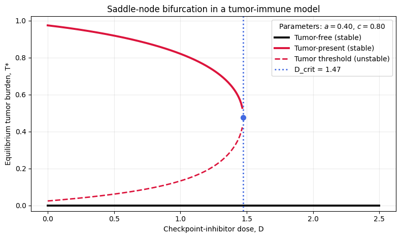

# Saddle-Node Bifurcation Analysis in Tumour-Immune Checkpoint Model

This repository implements a 2D non-linear system of ordinary differential equations (ODEs) derived from foundational paradigms in mathematical oncology (Kuznetsov et al., 1994). It models the non-linear dynamic interactions between an immunogenic tumour population ($T$) and active effector immune cells ($E$) under the influence of an immunotherapy drug dosage parameter ($D$).

---

## Project Overview

The project provides analytical and numerical tools to compute equilibrium states, trace linearized Jacobian stability, identify critical tipping points ($D_crit$), and map saddle-node (fold) bifurcations.

* **Model Formulation:** Logistic tumor growth combined with Holling Type-II immune clearance and drug-modulated checkpoint exhaustion.
* **Stability Criteria:** Analytical Jacobian evaluation and eigenvalue classification to distinguish stable attractors from unstable saddle points.
* **Bifurcation Mechanics:** Numerical bisection root-finding to isolate the critical dosage threshold $D_c$ where stable and unstable state branches collide and annihilate.

---

## Mathematical Formulation & Model Structure

The system models the interaction between tumor cell density ($T$) and effector immune cell density ($E$) over time:

$$\begin{aligned}
\frac{dT}{dt} &= \underbrace{a T \left(1 - \frac{T}{K}\right)}_{\text{Logistic Growth}} - \underbrace{\frac{c E T}{1 + \eta T + \gamma (1 - f(D)) T}}_{\text{Immune Clearance}} 
\frac{dE}{dt} &= \underbrace{s}_{\text{Baseline Influx}} + \underbrace{\frac{p E T}{g + T}}_{\text{Antigen Recruitment}} - \underbrace{d_e E}_{\text{Natural Mortality}} - \underbrace{\mu E T \Big(1 - f(D)\Big)}_{\text{Checkpoint Exhaustion}}
\end{aligned}$$

The drug effectiveness parameter function $f(D)$ modulates immune exhaustion and response scaling[cite: 3, 4]:

$$f(D) = \frac{D}{EC_{50} + D} \in [0, 1)$$

---

## System Parameters Reference

| Symbol | Parameter Description | Units |
| :--- | :--- | :--- |
| $a$ | Intrinsic tumor growth rate | $\text{day}^{-1}$ |
| $K$ | Tumor carrying capacity | $\text{cells}$ |
| $c$ | Maximum effector cell killing rate | $\text{cell}^{-1} \text{day}^{-1}$ |
| $\eta$ | Saturation constant for immune killing | $\text{cells}^{-1}$ |
| $\gamma$ | Checkpoint resistance factor | $\text{dimensionless}$ |
| $s$ | Constant influx rate of effector T-cells | $\text{cells day}^{-1}$ |
| $p$ | Maximum antigen-driven T-cell recruitment rate | $\text{day}^{-1}$ |
| $g$ | Tumor density for half-maximal recruitment | $\text{cells}$ |
| $d_e$ | Natural death rate of effector T-cells | $\text{day}^{-1}$ |
| $\mu$ | Rate of tumor-induced T-cell exhaustion | $\text{cell}^{-1} \text{day}^{-1}$ |
| $EC_{50}$ | Drug concentration for half-maximal efficacy | $\text{dosage units}$ |
| $D$ | Applied continuous drug dosage (Control Parameter) | $\text{dosage units}$ |

---

## Equilibrium States ($\frac{dT}{dt} = 0$, $\frac{dE}{dt} = 0$)

Setting derivative rates to zero yields up to three distinct steady states depending on the drug concentration $D$:

1. **Tumor-Free Equilibrium ($P_0$):**
   $$T^* = 0, \quad E^* = \frac{s}{d_e}$$
   Represents complete clinical clearance and immune surveillance.

2. **Controlled Co-existence State ($P_1$):**
   $$T^* > 0 \text{ (Low)}, \quad E^* > 0 \text{ (High)}$$
   Represents chronic tumor control and dormancy.

3. **Runaway Escape State ($P_2$):**
   $$T^* \approx K \text{ (High)}, \quad E^* \text{ (Exhausted / Low)}$$
   Represents clinical progression and treatment failure.

---

## Linearization & Stability Conditions

The local stability of any steady state point $$(T^*, E^*)$$ is governed by the eigenvalues $\lambda$ of the system's Jacobian matrix $$J(T^*, E^*)$$:

$$J(T^*, E^*) = \begin{bmatrix} 
\frac{\partial (dT/dt)}{\partial T} & \frac{\partial (dT/dt)}{\partial E} \\
\frac{\partial (dE/dt)}{\partial T} & \frac{\partial (dE/dt)}{\partial E}
\end{bmatrix}_{(T^*, E^*)}$$

Where:
* $J_{11} = a\left(1 - \frac{2T^*}{K}\right) - \frac{c E^*}{1 + \eta T^* + \gamma (1 - f) T^*} + \frac{c E^* T^* (\eta + \gamma (1 - f))}{\left(1 + \eta T^* + \gamma (1 - f) T^*\right)^2}$
* $J_{12} = -\frac{c T^*}{1 + \eta T^* + \gamma (1 - f) T^*}$
* $J_{21} = \frac{p E^* g}{(g + T^*)^2} - \mu E^* (1 - f(D))$
* $J_{22} = \frac{p T^*}{g + T^*} - d_e - \mu T^* (1 - f(D))$

An equilibrium state is **stable** if and only if all eigenvalues have negative real parts:

$$\operatorname{Re}(\lambda_i) < 0 \quad \forall i \in \{1, 2\}$$

A **Saddle-Node (Fold) Bifurcation** occurs at the critical dosing threshold $D_c$ where a zero real eigenvalue emerges:

$$\det\Big(J(T^*, E^*; D_c)\Big) = 0$$

---

## Visualizations & Results

.png)
*Figure 1: Population trajectories of immune T-cells ($E$) over time under varying dosing regimes.*

.png)
*Figure 2: Population trajectories of tumor cells ($T$) over time under varying dosing regimes..*


*Figure 3: Bifurcation diagram illustrating stable endemic states, unstable saddle boundaries, and the critical tipping point $D_crit$.*

---

## Guide for Implementation

### 1. Clone Repository
```bash
git clone https://github.com/manaswinisxccal/saddle-point-bifurcation-analysis.git https://github.com/manaswinisxccal/saddle-point-bifurcation-analysis.git
cd saddle-point-bifurcation-analysis
```
### 2. Install dependencies
```bash
pip install -r requirements.txt
```
### 3. Run Analysis
```bash
python Bifurcation_Analysis.py
```
git clone [https://github.com/your-username/saddle-point-bifurcation-analysis.git](https://github.com/your-username/saddle-point-bifurcation-analysis.git)
cd saddle-point-bifurcation-analysis
